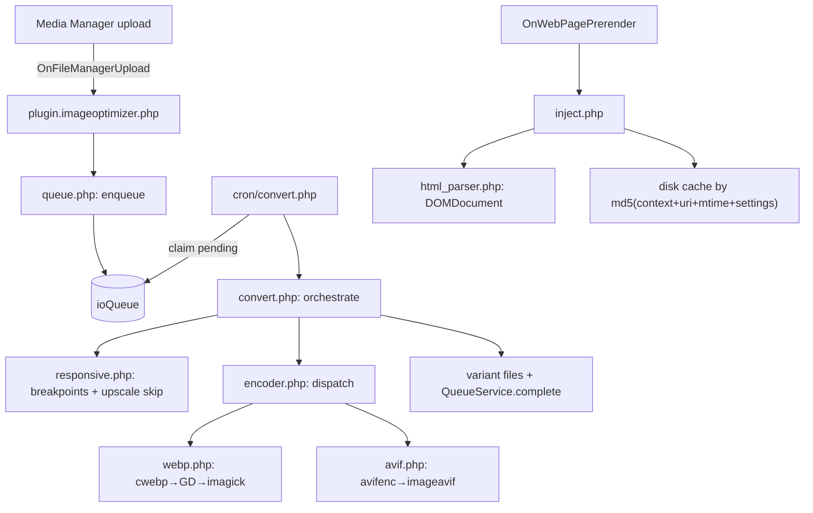

# ImageOptimizer — PRD / план разработки

**Версия релиза:** `1.0.0-beta1`
**Платформа:** MODX 3.0+, PHP 8.2+, MiniShop3
**Паттерн сборки:** BannerPro
**Обновление статуса:** 2026-06-28

## Обзор

Бесплатное дополнение для MODX 3 + MiniShop3: авто-конвертация изображений в WebP/AVIF при загрузке, responsive srcset по брейкпоинтам, ретро-bulk через CLI/cron, инъекция `<picture>` в HTML MiniShop3 без правки чанков. Не конкурирует с Thumb3x (ресайз/фильтры/водяные знаки остаются ему), компонируется через `skip_src_pattern` и `respect_existing_srcset`.

## Статус реализации

| Фаза | Содержание | Статус |
|------|------------|--------|
| 1 | Скаффолд (build, config, bootstrap, CI, package.json, vite) | ✅ |
| 2 | Модель `ioQueue` + resolver_tables + schema | ✅ |
| 3 | Настройки + lexicon + elements (plugins/menus/settings) | ✅ |
| 4 | PHP-ядро (enum, paths, settings, encoder, preflight, responsive, convert, queue) | ✅ |
| 5 | `file_lifecycle` + плагин + CLI/cron | ✅ |
| 6 | inject (`html_parser`, `img_skip_rules`, `picture_builder`) | ✅ |
| 7 | Connector + API handlers | ✅ |
| 8 | Vue admin UI (PrimeVue) | ✅ |
| 9 | Resolvers (policy, uninstall) + docs | ✅ базовые docs |
| 10 | Тесты + сборка transport zip | ⏳ PHPUnit/PHPStan OK; transport zip на MODX |

**Реализованные отличия от первоначального плана:**

- Событие загрузки: `OnFileManagerUpload` + `OnFileManagerFileCreate` (в MODX 3 нет `OnFileManagerFileAdd`).
- Вариант `width=0`: `image.jpg.webp`, не `image.jpg.0.webp`.
- Connector: action-based API (`queue/list`, `settings/get` и т.д.), не REST path routing.

## Цели и позиционирование

Бесплатное дополнение под MODX 3 (PHP 8.2+) и MiniShop3. Закрывает боли, которых нет у `Thumb3x`:

1. Конвертация **при загрузке** (не «на лету»).
2. **Responsive srcset** по брейкпоинтам (480/768/1024/1440/1920) с генерацией N вариантов.
3. **Ретро-bulk** по существующему каталогу через CLI/cron с resume.
4. **Авто-`<picture>`** инъекция в HTML MiniShop3 через `OnWebPagePrerender` без правки чанков.

Не входит (отдаём Thumb3x и платной надстройке Pro): ресайз-на-лету, фильтры, водяные знаки, CDN-выгрузка, автоматический AVIF по умолчанию.

## Стек и требования

- MODX 3.0+, PHP 8.2+ (readonly properties, backed enum для статусов очереди).
- Зависимости: `pdoTools`, **VueTools >=1.1.2-pl** (Vue 3.5.32, Pinia 3.0.4, PrimeVue 4.5.5, `@primeuix/themes`, `primeicons`, `primeflex`, `primelocale` ^2.3.1, `@vuetools/usePrimeVueLocale`).
- Энкодеры: `cwebp`/`avifenc` через `exec()` по whitelist; fallback `imagewebp()` (GD), `imagick::writeImage('webp')`. AVIF — opt-in.
- Без composer-зависимостей в PHP-ядре. Frontend-сборка — Vite с import map VueTools.
- Тема: preset `ImageOptimizerPreset` через `definePreset(Aura, {...})`, accent cyan/teal, dark mode через `.modx-dark-mode`.

## Архитектура



## Структура каталога

```
Extras/ImageOptimizer/
├── prd.md                             # этот документ
├── README.md
├── _build/
│   ├── build.php
│   ├── config.inc.php
│   ├── elements/
│   │   ├── plugins.php
│   │   ├── settings.php
│   │   ├── menus.php
│   │   └── snippets.php
│   └── resolvers/
│       ├── resolver_tables.php
│       ├── resolver_settings.php
│       ├── resolver_setup.php
│       ├── resolver_policy.php        # ✅
│       └── resolver_uninstall.php     # ✅
├── core/components/imageoptimizer/
│   ├── bootstrap.php
│   ├── include/
│   │   ├── helpers.php
│   │   ├── paths.php
│   │   ├── settings.php
│   │   ├── enum_status.php
│   │   ├── queue.php
│   │   ├── file_lifecycle.php
│   │   ├── preflight.php
│   │   ├── limits.php
│   │   ├── responsive.php
│   │   ├── encoder.php
│   │   ├── webp.php
│   │   ├── avif.php
│   │   ├── convert.php
│   │   ├── html_parser.php
│   │   ├── img_skip_rules.php
│   │   ├── picture_builder.php
│   │   ├── inject.php
│   │   ├── cli.php
│   │   ├── http.php
│   │   ├── handlers.php
│   │   ├── server_check.php
│   │   └── policy.php                 # TODO
│   ├── controllers/index.class.php
│   ├── cron/convert.php, prune.php
│   ├── cli/convert.php
│   ├── elements/plugins/plugin.imageoptimizer.php
│   ├── lexicon/{en,ru,uk}/
│   ├── model/imageoptimizer/
│   ├── schema/
│   └── docs/
├── assets/components/imageoptimizer/
│   ├── connector.php
│   ├── css/mgr/main.css
│   └── js/mgr/src/ + vue-dist/
└── docs/                              # TODO: расширенная документация
```

## Схема БД — `imageoptimizer_queue`

Класс `ioQueue`, namespace `imageoptimizer`.

Поля:

- `source` int unsigned (MediaSource ID)
- `path` varchar(255) — относительный путь от корня MediaSource
- `format` varchar(10) — `webp` | `avif`
- `width` int unsigned — 0 = оригинал, N = брейкпоинт
- `status` varchar(20) — `pending|processing|done|failed|skipped`
- `skip_reason` varchar(64) null
- `original_size` int unsigned null — только в строке `width=0`
- `converted_size` int unsigned null
- `error` text null
- `created_at`, `processed_at`, `locked_at` datetime null

Индексы: unique(source, path, format, width); BTREE(status); BTREE(source); BTREE(path); BTREE(locked_at).

PHP 8.2 backed enum `QueueStatus` и `SkipReason` в `include/enum_status.php`.

## Энкодер — pipeline стратегий

`EncoderPipeline` с массивом `ImageOptimizerEncoder`: first-success-wins, фильтр `isAvailable()`, приоритет из `imageoptimizer.method_priority`.

Реализации: `CwebpEncoder`, `GdWebpEncoder`, `ImagickWebpEncoder`; `AvifencEncoder`, `GdAvifEncoder`.

`exec()` только на whitelist: `cwebp`, `avifenc`. Аргументы через `escapeshellarg()`.

## Pre-flight — `preflight.php`

| MIME / условие | SkipReason |
|---|---|
| `image/svg+xml` | `svg_skip` |
| `image/webp` | `already_webp` |
| animated GIF/PNG | `animated_not_supported` |
| HEIC/HEIF без декодера | `heic_no_decoder` |
| MediaSource не filesystem | `non_filesystem_source` |

## Memory / time safety — `limits.php`

- `bumpMemoryLimit()` с потолком `max_memory_limit` (default `512M`).
- `checkTimeBudget()` для CLI/cron.
- `MemoryLimitException` → skip с `memory_limit`.

## Качество и метаданные

- `quality_jpeg=82`, `quality_png=90`, fallback `quality=82`.
- `preserve_exif=false`, `preserve_icc=true`.
- `reencode_if_unchanged=false`.
- `EncodeOptions` value object → `EncoderPipeline::encode()`.

## Responsive srcset — `responsive.php`

- `parseBreakpoints()`, `shouldGenerateVariant()`, `resolveSizes()`, `buildSrcset()`.
- Имя варианта: `image.jpg.webp` (width=0), `image.jpg.480.webp`, …
- Паттерн: `variant_pattern` = `{basename}.{width}.{ext}`.
- Дефолт брейкпоинтов: `480,768,1024,1440,1920`.

## CLI/cron

`cli/convert.php`:

- `--source=N`, `--limit=`, `--resume`, `--dry-run`, `--format=`, `--breakpoints=`, `--time-budget=`, `--json`, `--scan`, `--path=`

`cron/convert.php`: flock lock, stuck reset, лимит из `cron_limit`.

`cron/prune.php`: удаление `done` старше `retention_days`.

Claim — атомарный `SELECT ... FOR UPDATE` + `UPDATE` в транзакции.

## Фронт-инъекция

`OnWebPagePrerender`:

1. Guards: HTML content type, контекст ≠ mgr, не XHR, `inject_frontend`, `max_html_size`.
2. Кэш: `md5(context|uri|editedon|settingsHash|variantsGeneration)` в `cache/imageoptimizer/html/`. `variantsGeneration` инкрементируется при каждом `queue_mark_done`.
3. `DOMDocument` через `html_parser.php`.
4. `ImageOptimizerImgSkipRules::shouldSkip()` — picture parent, srcset, thumb3x pattern, classes, data-skip, meta parent.
5. `picture_builder.php` — AVIF source перед WebP.
6. Lazy/fetchpriority/decoding по настройкам.

## Жизненный цикл файла

- `OnFileManagerUpload` / `OnFileManagerFileCreate` — enqueue + sync convert (`convert_on_upload_sync_timeout`).
- `OnFileManagerFileUpdate` — re-enqueue + sync.
- `OnFileManagerFileRemove` — delete variants + queue rows.
- `OnSiteRefresh` / `OnCacheUpdate` — clear HTML cache.

## Uninstall + policy

`resolver_uninstall.php`: cleanup variants/table/cache/settings по `cleanup_on_uninstall`.

`resolver_policy.php`: permissions `imageoptimizer_view`, `imageoptimizer_settings`, `imageoptimizer_run`.

## Connector API (реализовано)

`assets/components/imageoptimizer/connector.php`, action-based:

| Action | Permission |
|--------|------------|
| `queue/list` | `imageoptimizer_view` |
| `queue/retry` | `imageoptimizer_run` |
| `queue/rebuild` | `imageoptimizer_run` |
| `queue/clear` | `imageoptimizer_run` |
| `queue/reset_stuck` | `imageoptimizer_run` |
| `stats/summary` | `imageoptimizer_view` |
| `settings/get` | `imageoptimizer_view` |
| `settings/update` | `imageoptimizer_settings` |
| `server/check` | `imageoptimizer_view` |
| `compatibility/list` | `imageoptimizer_view` |

## Vue admin

Сборка: `npm run build` → `assets/components/imageoptimizer/js/mgr/vue-dist/`.

Компоненты: Dashboard, QueueGrid, SettingsForm, ServerCheck, CompatibilityTab, Rebuild/Clear dialogs, composables API/notify/polling.

## Системные настройки

Префикс `imageoptimizer_`, area `imageoptimizer`. Полный список в `_build/elements/settings.php`.

Ключевые defaults: `breakpoints=480,768,1024,1440,1920`, `skip_src_pattern=thumb3x`, `cron_limit=200`, `convert_on_upload_sync_timeout=5`, `max_html_size=1048576`, `retention_days=30`, `stuck_minutes=30`.

## Документация

`docs/cli.md`, `frontend-guide.md`, `server-requirements.md`, `compatibility.md`, `permissions.md`, `troubleshooting.md`. Остальные из списка ниже — при необходимости перед релизом.

## Testing gates

1. ✅ `php -l` в `_build/build.php` (при сборке пакета).
2. ✅ PHPStan level 5 на `include/`.
3. ✅ PHPUnit: paths, responsive, img_skip_rules, inject fixtures, preflight, ACL, html_cache generation.
4. ⏳ Integration smoke: MODX 3 + MiniShop3 + VueTools.
5. ⏳ Transport zip `1.0.0-beta1`, установка через Installer.

## Security

- `exec()` whitelist, `escapeshellarg()`.
- MIME через `mime_content_type()` / `finfo`.
- Connector: mgr auth + policy per action.
- Атомарный claim очереди.

## Фазы (чеклист)

1. ✅ Скаффолд extra + build + namespace + gitignore + package.json + vite + composer + CI
2. ✅ Модель ioQueue + map + metadata + schema + resolver_tables
3. ✅ Системные настройки + lexicon en/ru/uk
4. ✅ enum_status + paths + settings + helpers
5. ✅ server_check + webp + avif + encoder + EncodeOptions
6. ✅ preflight + limits + responsive + convert
7. ✅ queue service (FOR UPDATE, stuck detection)
8. ✅ file_lifecycle + OnFileManagerUpload/Create/Update/Remove + cache invalidate
9. ✅ cli/convert + cron/convert (flock) + cron/prune + cli.php
10. ✅ html_parser + img_skip_rules + picture_builder + inject
11. ✅ connector + handlers (queue/settings/server/compatibility)
12. ✅ Vue admin (PrimeVue через VueTools)
13. ✅ resolver_policy + resolver_uninstall
14. ✅ docs (базовые guides + troubleshooting)
15. ✅ PHPUnit (41 tests) + PHPStan; ⏳ integration smoke
16. ⏳ Сборка пакета 1.0.0-beta1 + modstore beta

## Уровни качества

- Один файл `include/` — одна ответственность, ~300 строк max.
- Skip-предикаты только в `ImgSkipRules`, не в `inject.php`.
- Формат-специфика в `webp.php`/`avif.php`, не в `convert.php`.
- DOMDocument для HTML, не regex.
- Импорты только вверху файла.
